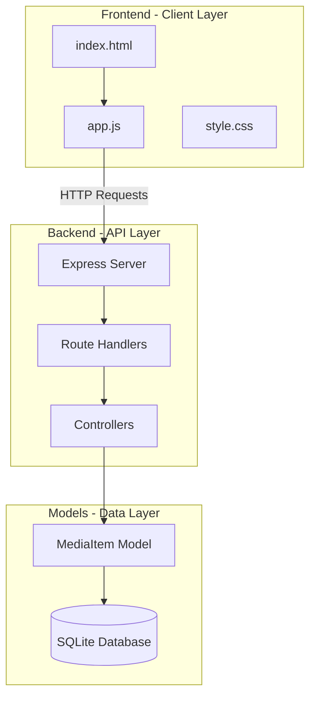

# Backend Architecture Plan - Media Tracker (Simplified)

## Current State Analysis

### Project Structure Overview

```
Avance_de_Proyecto_Fullstack/
├── application/
│   ├── backend/
│   │   ├── server.js (inline CRUD + static frontend serving)
│   │   ├── media_tracker.db
│   │   ├── package.json (express, sqlite3)
│   │   └── src/
│   │       ├── config/
│   │       │   ├── database.js (points to wrong path)
│   │       │   └── schema.js (complete schema defined)
│   │       ├── models/
│   │       │   ├── User.js (with bcrypt)
│   │       │   └── MediaItem.js
│   │       ├── controllers/
│   │       │   ├── userController.js (JWT auth)
│   │       │   └── mediaController.js
│   │       ├── routes/
│   │       │   ├── userRoutes.js
│   │       │   └── mediaRoutes.js
│   │       └── middleware/
│   │           └── auth.js (JWT verification)
│   └── frontend/
│       ├── index.html
│       ├── app.js
│       └── style.css
└── planning/
    └── backend_architecture_plan.md (this file)
```

---

## Issues to Fix (Without Authentication)

### 1. Database Path Mismatch - CRITICAL
- **Issue**: `src/config/database.js` looks for `data/media_tracker.db`
- **Current**: Database is at `backend/media_tracker.db`
- **Fix**: Update database.js path to `../media_tracker.db`

### 2. Backend Structure Disconnect - CRITICAL
- **Issue**: `server.js` has inline CRUD endpoints that bypass the proper MVC structure
- **Problem**: Routes in `src/routes/` are defined but never imported into `server.js`
- **Fix**: Remove inline CRUD from server.js, import and use proper routes

### 3. Schema Inconsistencies - NEEDS FIX
| Frontend Field | Backend Expected | Issue |
|----------------|------------------|-------|
| `media_type` | `media_type` | Should work with string values |
| `rating` (1-3) | `rating` (0-5) | Scale mismatch - needs conversion |
| `status` | `watched` | Field name mismatch |
| `reason` | `reason` | OK |
| `notes` | `note` | Name mismatch |

---

## Simplified Architecture

### System Flow



---

## Simplified Implementation Plan

### Phase 1: Fix Database Path
**File**: `application/backend/src/config/database.js`

```javascript
const dbPath = path.join(__dirname, '..', 'media_tracker.db');
```

### Phase 2: Refactor server.js
**Goal**: Use proper routes from `src/routes/`

```javascript
const express = require('express');
const path = require('path');
const mediaRoutes = require('./src/routes/mediaRoutes');

const app = express();
app.use(express.json());

// Use proper routes
app.use('/api/media', mediaRoutes);

// Serve static files from frontend directory
app.use(express.static(path.join(__dirname, '../frontend')));

app.listen(3000, () => console.log('Server running on port 3000'));
```

### Phase 3: Update MediaController and MediaItem Model
**Fix field mapping**:

1. In `mediaController.js`, add field conversion:
   - `notes` → `note`
   - `status` → `watched` (0/1)
   - Rating scale conversion (1-3 → 0-5)

2. In `MediaItem.js`, update the create method to accept frontend fields

### Phase 4: Update Frontend API Calls
**File**: `application/frontend/app.js`

Update `addMediaToAPI` to send correct field names and rating scale.

---

## Files to Modify

| File | Changes |
|------|---------|
| `src/config/database.js` | Fix database path |
| `server.js` | Remove inline CRUD, use proper routes |
| `src/controllers/mediaController.js` | Add field mapping |
| `src/models/MediaItem.js` | Update to accept frontend fields |
| `frontend/app.js` | Fix field names and rating scale |

---

## Field Mapping Details

### Frontend → Database Mapping

| Frontend Field | Database Field | Conversion |
|----------------|----------------|------------|
| `title` | `title` | Same |
| `media_type` | `media_type` | Keep as string (movie/series/game) |
| `note` | `note` | Same |
| `reason` | `reason` | Same |
| `rating` | `rating` | Frontend 1-3 → DB 1-3 (keep same scale) |
| `status` | `watched` | `watched` = 1 if status === 'watched' |

### Database → Frontend Mapping

| Database Field | Frontend Field | Conversion |
|----------------|----------------|------------|
| `id` | `id` | Same |
| `title` | `title` | Same |
| `media_type` | `media_type` | Same |
| `note` | `note` | Same |
| `reason` | `reason` | Same |
| `rating` | `rating` | Same (1-3) |
| `watched` | `status` | `watched` ? 'watched' : 'to_watch' |

---

## Implementation Steps

### Step 1: Fix database.js path
```javascript
// Before
const dbPath = path.join(__dirname, '..', '..', 'data', 'media_tracker.db');

// After
const dbPath = path.join(__dirname, '..', 'media_tracker.db');
```

### Step 2: Update server.js
1. Remove inline CRUD endpoints (lines 58-117)
2. Add route imports
3. Add route middleware

### Step 3: Update MediaItem model
Update the `create` method to use simplified schema:
- Use `media_type` text field instead of FK to `media_types` table
- Use `watched` (0/1) instead of `status` text field

### Step 4: Update mediaController.js
Add field mapping from frontend format to database format.

### Step 5: Update frontend app.js
Ensure API calls send correct field names.

---

## Testing Checklist

- [ ] Server starts without errors
- [ ] Frontend loads at http://localhost:3000
- [ ] Adding media items works
- [ ] Loading media items displays correctly
- [ ] Marking as watched works
- [ ] Rating system works (1-3 scale)
- [ ] Tab switching works for movies/series/games
- [ ] Delete functionality works
